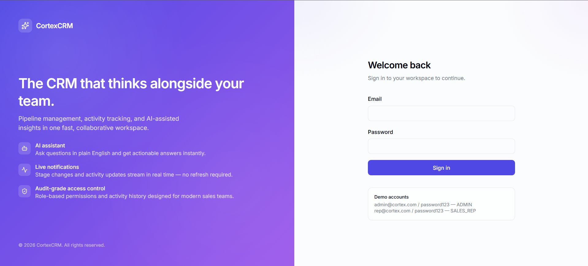
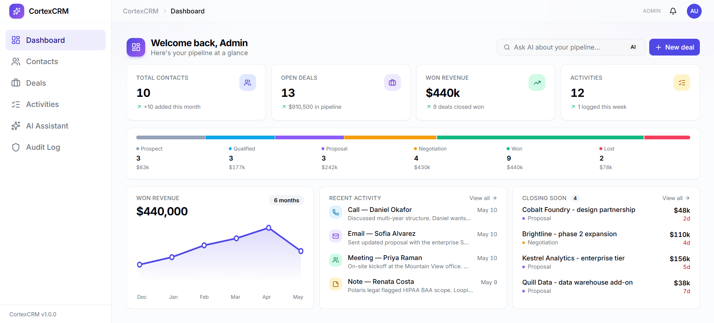
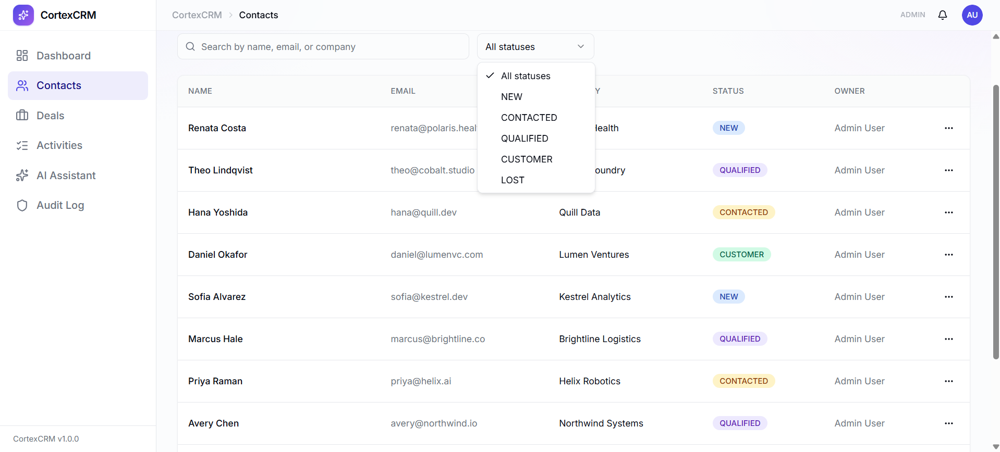
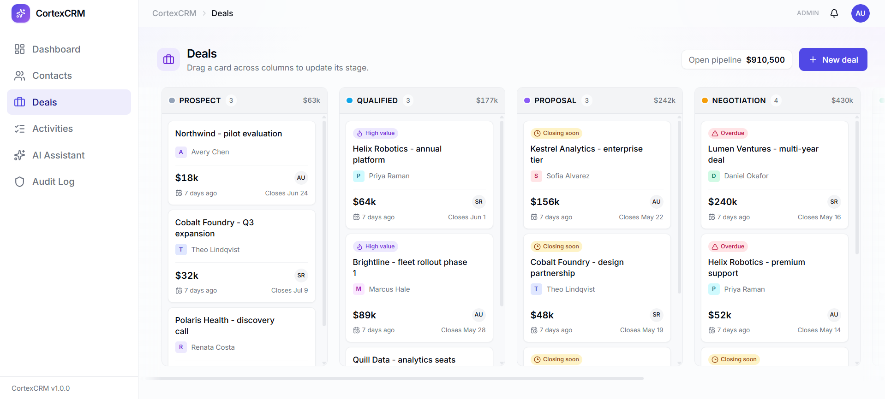
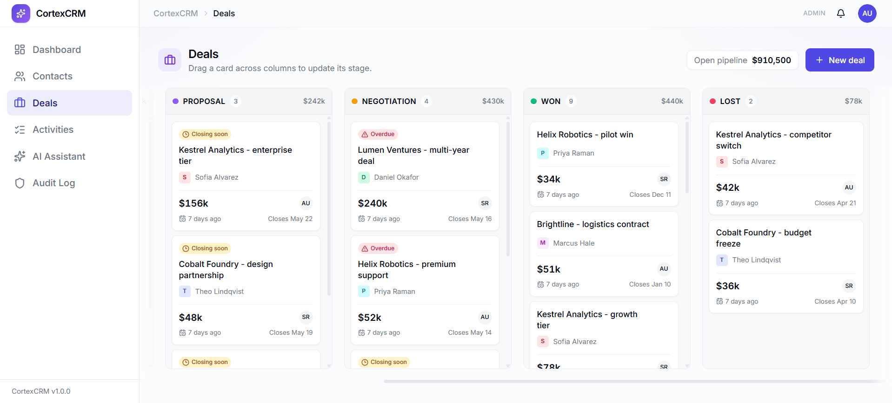
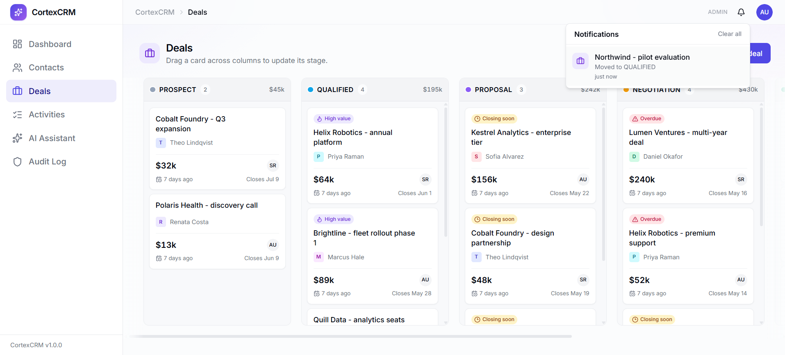
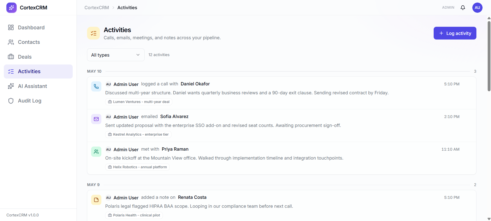
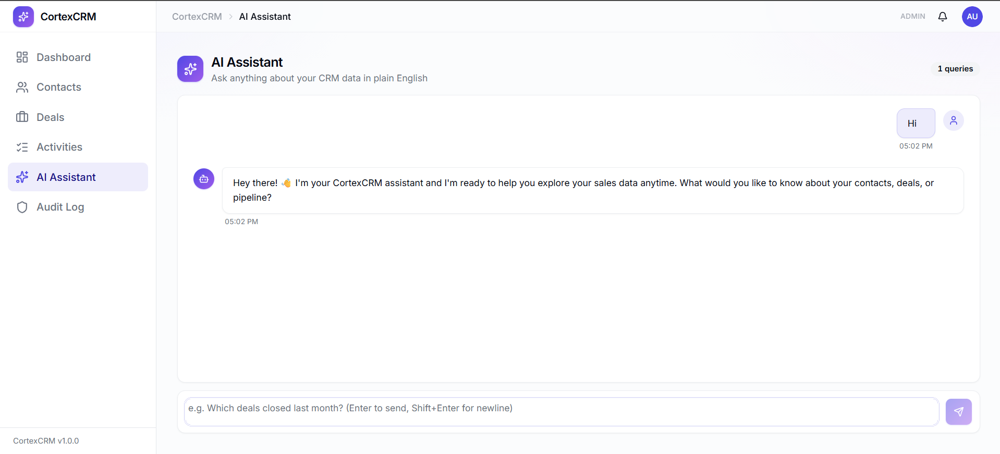
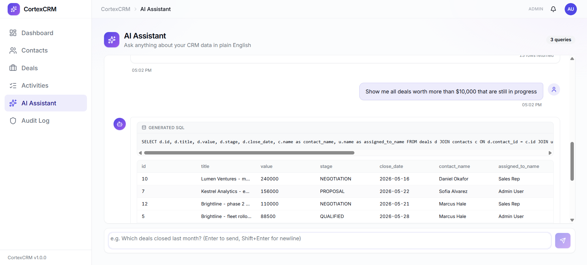
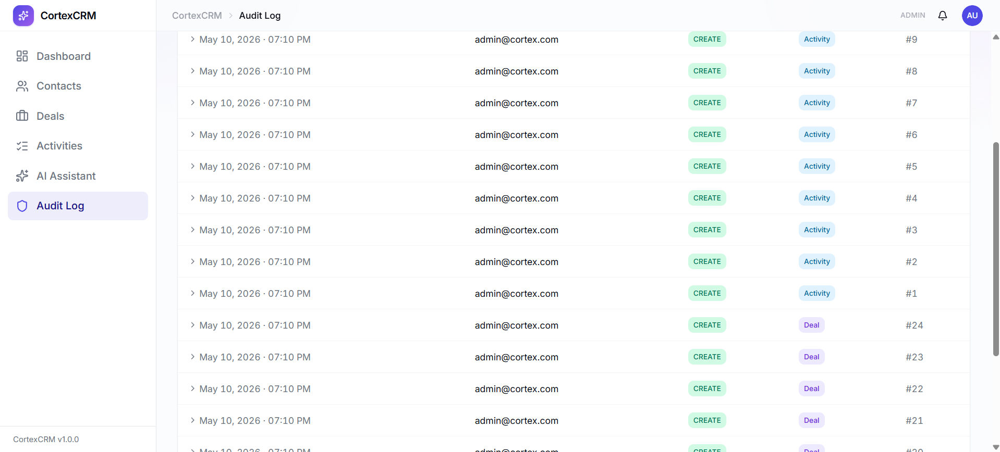

# CortexCRM

A full-stack AI-powered CRM application. Contacts, deals, activities, and a real-time notification system — all queryable in plain English through an embedded Claude AI assistant.

---

## Tech Stack

**Backend** — Java 21 · Spring Boot 3.5 · Spring Security (JWT + RBAC) · Spring Data JPA · Flyway · Redis · SSE

**Frontend** — React 19 · Vite · TypeScript · Tailwind CSS v3 · shadcn/ui · TanStack Query · Zustand · @dnd-kit

**Database** — PostgreSQL 16 · Redis 7

**AI** — Anthropic Claude API (`claude-haiku-4-5-20251001`) — NL-to-SQL, contact summaries, email drafts

---

## Features

- **JWT authentication** with three roles: ADMIN · MANAGER · SALES_REP
- **Contacts** — full CRUD with status tracking and rep assignment
- **Deals** — Kanban board with drag-and-drop stage progression
- **Activities** — day-grouped feed (calls, emails, meetings, notes)
- **Real-time notifications** via Server-Sent Events (deal stage changes, new activities, contact assignments)
- **AI Assistant** — ask questions in plain English; Claude generates and executes SQL, returns a data table or a conversational reply
- **AI contact tools** — 3-sentence lead summary and follow-up email draft per contact
- **Audit log** — every create/update/delete recorded with before/after JSON snapshots (ADMIN + MANAGER)
- **Row-level access control** — sales reps see only their own records

---

## Local Setup

### Prerequisites

| Tool | Version |
|---|---|
| JDK | 21+ |
| Docker Desktop | any recent |
| Node.js | 18+ |

### 1. Start the database and cache

```bash
cd cortex-backend
docker compose up -d
```

This starts PostgreSQL 16 on port `5432` and Redis 7 on port `6379`.

### 2. Start the backend

```bash
# Windows (PowerShell) — use env var, not -D flag
cd cortex-backend
$env:SPRING_PROFILES_ACTIVE="local"
.\mvnw spring-boot:run

# macOS / Linux
cd cortex-backend
SPRING_PROFILES_ACTIVE=local ./mvnw spring-boot:run
```

The `local` profile loads `application-local.yml` (gitignored). Copy `.env.example` and fill in your secrets, then set them as environment variables before first run.

Flyway runs all 6 database migrations automatically on first boot. The server starts on **http://localhost:8080**.

`CLAUDE_API_KEY` is only required for AI features. The app starts and runs without it; AI endpoints return a `503` when the key is absent.

### 3. Start the frontend

```bash
cd cortex-frontend
npm install
npm run dev
```

Opens on **http://localhost:5173**.

### 4. Seed demo data (optional)

```powershell
# From cortex-frontend/scripts/ (PowerShell)
.\seed-demo.ps1
```

Seeds 8 contacts, 24 deals across all stages, and 12 activities including 6 months of WON revenue history for the dashboard chart.

### Demo accounts

| Email | Password | Role |
|---|---|---|
| admin@cortex.com | password123 | ADMIN |
| rep@cortex.com | password123 | SALES_REP |

---

## Architecture

```
cortex-frontend (React + Vite)        :5173
        │  REST + SSE (Axios / EventSource)
cortex-backend (Spring Boot)          :8080
        │                    │
   PostgreSQL :5432      Redis :6379
                              │
                      AI conversation memory
                      (per-user, 1h TTL)
        │
   Anthropic Claude API
   (NL→SQL · summaries · emails)
```

### Backend package layout

```
com.cortexcrm
├── controller/     REST endpoints (Auth, User, Contact, Deal, Activity, Notification, Audit, AI)
├── service/        Business logic
├── entity/         JPA entities (User, Contact, Deal, Activity, AuditLog)
├── repository/     Spring Data JPA repositories
├── dto/            Request + Response records
├── security/       JwtFilter, JwtUtil, SecurityConfig, CurrentUserService
├── ai/             ClaudeClient, PromptBuilder, SqlGuard, AiMemoryService
├── sse/            SseEmitterRegistry, NotificationListener, HeartbeatScheduler
└── audit/          AuditEntityListener, AuditWriter
```

### Key design decisions

- **Stateless JWT** — no sessions; token in `Authorization: Bearer` header (or `?token=` query param for SSE, since `EventSource` cannot set headers)
- **Flyway migrations** — schema is version-controlled; `ddl-auto: validate` keeps Hibernate from touching the schema
- **AuditLog written via JdbcTemplate**, not JPA — avoids flush-during-flush errors inside `@EntityListeners`
- **AI memory in Redis** — per-user conversation thread capped at 10 messages, 1h TTL; gives Claude context for follow-up questions
- **SqlGuard** — strips string literals before checking for forbidden keywords; SELECT-only, no semicolons, no DDL/DML

---

## Environment Variables

| Variable | Service | Required | Notes |
|---|---|---|---|
| `CLAUDE_API_KEY` | Backend | For AI features | App runs without it; AI endpoints return 503 |
| `JWT_SECRET` | Backend | Production | Dev default is in `application.yml`; override in prod |
| `VITE_API_URL` | Frontend | No | Defaults to `http://localhost:8080` |

---

## API Reference (summary)

| Method | Path | Auth |
|---|---|---|
| POST | `/api/auth/register` | Public |
| POST | `/api/auth/login` | Public |
| GET/POST/PUT/DELETE | `/api/contacts` | Authenticated |
| GET/POST/PUT/DELETE | `/api/deals` | Authenticated |
| PUT | `/api/deals/{id}/stage` | Authenticated |
| GET/POST/PUT/DELETE | `/api/activities` | Authenticated |
| GET | `/api/notifications/stream` | Authenticated (SSE) |
| POST | `/api/ai/query` | Authenticated |
| POST | `/api/ai/summarize/{contactId}` | Authenticated |
| POST | `/api/ai/draft-email/{contactId}` | Authenticated |
| GET | `/api/audit` | ADMIN + MANAGER |
| GET/PUT | `/api/users` | ADMIN |

---

## Known Issues

- SSE registry is in-memory — works for a single server instance. Multi-instance deployment requires Redis Pub/Sub for fan-out.
- Audit UPDATE rows capture post-update state in both `old_value` and `new_value` columns. A full before/after diff would require a pre-update snapshot (deferred to v2).

---

## Screenshots

### Login


### Dashboard


### Contacts


### Deal Pipeline



### Real-time Notifications


### Activities


### AI Assistant



### Audit Log

